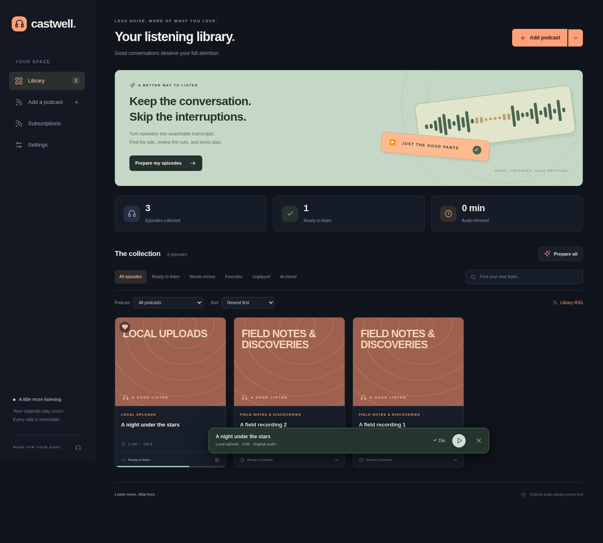
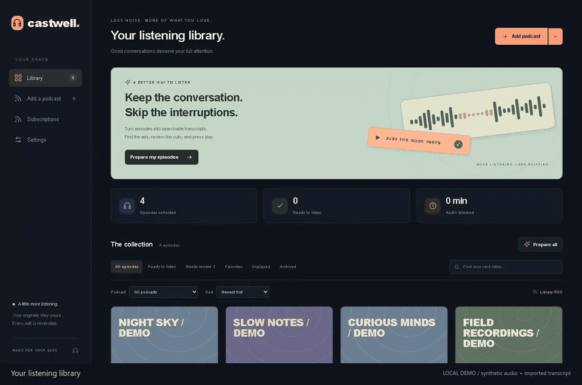
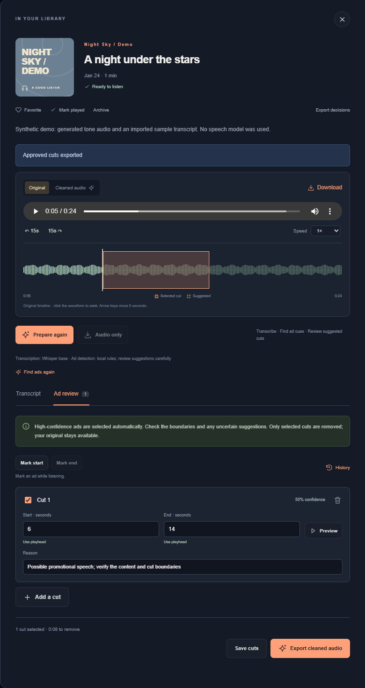

# Castwell

**Your podcast library, with searchable transcripts and cuts you control.**

A personal podcast library that downloads episodes, creates searchable transcripts, finds likely advertisements, and exports a listening copy with your approved cuts. Originals stay available, and every cut can be reviewed or restored.

[Get started](#start-listening) | [Watch the tour](#see-it-in-action) | [Docker](#docker) | [Local AI](#run-the-classifier-locally) | [Ad-read evaluation](docs/ad-read-evaluation.md) | [Configuration](#configuration-and-backups) | [Development](#development)



## A library built around listening

- **Bring your own shows.** Subscribe by RSS, import OPML, or upload recordings. Filter your library, save favorites, and pick up where you left off.
- **Find the moment.** Create local Whisper transcripts, search the text, and jump straight to a timestamp. Keep listening with the mini player while you browse.
- **Review every cut.** Inspect suggested advertisements on the waveform, adjust their boundaries, and export the selections you approve. Originals and recent cut revisions stay available.
- **Keep your options open.** Use local rules, run an optional local AI classifier, or connect an OpenAI-compatible service. Download audio and transcripts, or use Library RSS in a reachable podcast player.

## See it in action

[](docs/media/castwell-tour.mp4)

**[Watch or download the MP4 tour](docs/media/castwell-tour.mp4)**

<details>
<summary>Explore the ad review panel</summary>

Open an episode to review its transcript, compare original and cleaned playback, and choose exactly what to cut:



</details>

*Screenshots, GIF, and video show the running application with synthetic local demo data. They demonstrate the interface, not speech-model or advertisement-detection accuracy. See [validation results](docs/validation.md) for the checks performed and their limitations.*

## Start listening

Clone [mgelsinger/castwell](https://github.com/mgelsinger/castwell) on your device:

```bash
git clone https://github.com/mgelsinger/castwell.git
cd castwell
```

The native application requires **Python 3.10+** and **FFmpeg** (`ffmpeg` and `ffprobe` on your PATH). On Debian or Ubuntu, install FFmpeg with `sudo apt-get install ffmpeg`; on macOS with Homebrew, use `brew install ffmpeg`. Alternatively, the [Docker setup](#docker) includes Python and FFmpeg.

```bash
python3 -m venv .venv
source .venv/bin/activate
python -m pip install -e '.[transcription]'
python -m castwell --data-dir ./data
```

On Windows PowerShell, create the environment with `py -m venv .venv` and activate it with `.\.venv\Scripts\Activate.ps1`, then run the same install and start commands. Install FFmpeg separately and confirm `ffmpeg -version` and `ffprobe -version` work in that terminal.

A fresh checkout includes the application code. Speech models, classifier weights, and your podcast library are prepared or downloaded on your device; they are not included in GitHub.

Open **http://127.0.0.1:8000**. Castwell is a single-user application with no login; its default address is accessible only from the local machine. Keep the service on a trusted machine or behind authenticated private access. `python -m castwell --help` lists the host, port, storage, and speech-model options.

For a private deployment using another hostname, set `CASTWELL_ALLOWED_HOSTS=castwell.lan,192.168.1.25` to the exact hostnames or IP addresses clients will use. Loopback hosts are always allowed; other request hosts are rejected unless listed. Wildcards are not supported. This setting works alongside the listen address or reverse proxy and does not add authentication.

1. **Add a podcast or upload audio.** Use an RSS feed, import subscriptions from OPML, or upload MP3, WAV, M4A, MP4, FLAC, OGG, Opus, or AAC recordings up to 2 GB. Identical uploads are deduplicated.
2. **Prepare the speech model.** In Settings & models, choose a Whisper model, save settings, and select **Download model**. The default `base` model runs locally on the CPU. Environment check reports whether its files are available.
3. **Prepare episodes.** Process an episode or a batch. Castwell downloads the original, makes a waveform and transcript, proposes ad cuts for review. Review is enabled by default; only selections you approve are exported. **Audio only** downloads a recording without running transcription or detection.
4. **Review and listen.** Open Ad review, listen around the suggested boundaries, adjust timestamps, or use **Mark start / Mark end** while listening. Select the cuts you want, then export cleaned audio.

The gallery supports podcast and status filters, favorites, archived episodes, played/unplayed state, search, and sorting. Playback resumes at your saved position; change speed, skip 15 seconds, or keep listening through the mini player after closing the episode. The waveform shows the original timeline and proposed cuts. Search transcript text and click timestamps to hear the passage.

## Subscriptions and exports

Manage subscriptions to refresh one podcast or all podcasts and collect new episodes. Refreshing preserves downloaded audio, transcripts, listening state, and reviewed cuts. Unsubscribing keeps existing episodes. Refresh is manual; there is no background subscription schedule.

OPML imports accept up to 100 feeds per file and report individual failures without discarding successful imports. **Export OPML** omits subscription URLs containing user information or query parameters. The response header `X-Castwell-Private-Feeds-Omitted` gives the omitted count. Some providers place credentials in URL paths, which cannot reliably be recognized; treat exported subscription files as private too.

Episode tools provide:

- Original and cleaned audio playback and downloads.
- TXT, JSON, SRT, and VTT transcript downloads on the original or cleaned timeline.
- Editable ad decisions and the last 30 cut revisions per episode. Restoring a revision requires exporting again to apply it to audio.
- A JSON decision export containing the transcript, original timestamps, and cut decisions.
- **Library RSS**, at `/api/export/feed`, for prepared episodes. It includes cleaned copies and completed, no-cut analyses; archived episodes are excluded. Audio links point to this Castwell server, so the player reading the feed must be able to reach it.

Changing cuts or importing a replacement transcript invalidates the previous cleaned export. Downloads and rendered audio are published atomically. Jobs run one at a time, expose progress, and can be cancelled; cancellation retains completed work. Retrying reuses downloaded audio and valid transcripts, including an explicitly reviewed empty set of cuts. A fresh detection must be requested explicitly to replace prior decisions. **Regenerate transcript** runs speech recognition again while preserving reviewed cuts unless you also request new detection. After a restart, interrupted jobs are marked for retry.

## Advertisement detection

Two detection methods are available:

| Method | Behavior |
| --- | --- |
| Local rules | Recognizes English sponsorship language, commercial calls to action, and familiar transitions. Available without an AI service; subtle or unfamiliar ads need review. |
| Contextual AI | Checks commercial intent and edit boundaries in two separate passes, with verbatim transcript evidence for every unit. The policy distinguishes paid humor from unpaid parody and editorial quotations, but models can still confuse them. Disagreements and mixed speech require review. |

**Automatic** uses contextual AI when an endpoint and model are configured, otherwise local rules. The default verified policy reviews every transcript unit, including possible negatives. Agreed editorial judgments suppress keyword-only false positives. Local rules produce unapproved suggestions under this policy. An AI failure, incomplete configuration, or invalid response produces an error; it does not count as a successful no-ad result.

**Review every suggestion is on by default.** Listen and select the cuts yourself. If you turn review off, automatic approval still requires both AI passes to label the entire unit commercial at the adjustable threshold, initially **0.90**, with usable speech alignment. Recovered speech and conflicting judgments remain unapproved. Confidence is a model estimate, not a measured probability. The [measured results](docs/readiness-2026-10-08.md) include editorial speech passing both checks; this release does not establish safe unattended removal. Blended promotions, music-only ads, unclear speech, and timestamp errors can all produce mistakes.

Approved overlaps are merged. FFmpeg trims decoded audio and writes a separate 192 kbps MP3; a selection that would remove the entire recording is rejected. The classifier uses word-aligned sentence boundaries when available to reduce cuts that include surrounding conversation. For imported transcripts without word timestamps, a partially cut segment retains its text with a partial-text warning; its remaining words cannot be inferred precisely.

### Run the classifier locally

The stronger local candidate is **Qwen3.5-35B-A3B** with native llama.cpp. The tested Q4_K_M file is approximately 21.2 GB, converted locally from a pinned 36.9 GB ggml-org Q8 release. Allow at least 60 GB of disk for both files. Requantization can lose quality compared with conversion from original BF16 weights; this is a measured local candidate, not a Qwen-published Q4 release. See the [results and limitations](docs/readiness-2026-10-08.md). The classifier is separate from the Whisper speech model.

For Windows with an NVIDIA GPU, use the standalone **llama.cpp** server. The exercised version is [b11146](https://github.com/ggml-org/llama.cpp/releases/tag/b11146), using its Windows CUDA 12.4 x64 server and matching CUDA runtime archives. Extract both into `.local/llama.cpp` so `llama-server.exe`, `llama-quantize.exe`, and their DLLs are together. This path does not require Ollama or `llama-cpp-python`. Download, verify and convert the pinned model, then start the measured 24 GB GPU profile:

```powershell
.\.venv\Scripts\python.exe scripts/setup_qwen35_local.py
.\scripts\start_qwen35_local.ps1 -NoThinking -GpuLayers all -CpuMoeLayers 4 -Background
```

Model downloads need `huggingface-hub`, which is included with Castwell's transcription dependencies. The setup verifies source and quantizer hashes and records the converted model's hash. Four expert layers run on CPU in this RTX 3090 Ti profile, leaving about 2.1 GB of GPU memory free after the startup check. Other machines may need different offload settings. After preparation, start the model with the same launcher command and start Castwell in another terminal:

```powershell
.\scripts\start_castwell.ps1 -Background
```

The launchers bind to loopback and record process IDs and logs under `.local/logs`. Omit `-Background` to keep a server in the current terminal. They refuse to start if the chosen port is occupied. The `.local` directory is ignored by Git. To stop a background instance, stop its process; for the Python app on Windows, the HTTP listener can be a child of the recorded launcher PID.

The smaller **Qwen3-14B Q6_K** profile remains available with `.\.venv\Scripts\python.exe scripts/local_ai.py --download --size 14b --cache-dir .local/models --backend native --server-binary .local/llama.cpp/llama-server.exe --threads 8`, followed on later starts by `.\scripts\start_local_ai.ps1`. Its download is approximately 12.1 GB. Qwen2.5 7B and 3B variants are also available, but the recorded comparisons found consequential detection errors in the smaller candidates. Run only one model server on the shared endpoint.

For the older Qwen2.5 profile on Linux, install a C/C++ build toolchain, then build the optional dependency. This Python runtime is not the tested Qwen3.5 setup. `llama-cpp-python` is pinned to `0.3.16`; limit compiler parallelism to avoid excessive memory use:

```bash
sudo apt-get install build-essential cmake ninja-build
CC=gcc CXX=g++ CMAKE_BUILD_PARALLEL_LEVEL=3 \
  CMAKE_ARGS='-DGGML_CUDA=OFF -DGGML_NATIVE=OFF -DLLAMA_CURL=OFF' \
  python -m pip install -e '.[local-ai]'
python scripts/local_ai.py --download --size 7b --cache-dir ./data/models --threads 4
```

Keep that terminal running. In Castwell Settings, save these values and use **Test AI connection**:

| Setting | Value |
| --- | --- |
| API base URL | `http://127.0.0.1:8081/v1` |
| Model name | `castwell-local` |
| Detection method | Contextual AI or Automatic |

The helper listens only on `127.0.0.1` and needs no API key. `--port`, `--threads`, and `--context` adjust the server; the default context is 8192 tokens. Use `python scripts/local_ai.py --help` for options. To use an existing Qwen-compatible GGUF file instead, run `python scripts/local_ai.py --model /path/to/model.gguf`; for a split model, point to its first shard and keep the other shard beside it. Checksum verification is automatic for the pinned `--download` models; verify the provenance of a custom file yourself.

For a small CPU classifier, shorter transcript windows can reduce latency. Set `CASTWELL_AI_WINDOW_CHARS=3000` and `CASTWELL_AI_CONTEXT_SEGMENTS=3` in the **Castwell** process environment before starting the gallery. Larger windows provide more context at the cost of additional inference work. Enable **Review every suggestion** while evaluating a model on your podcasts; a smaller model can pass obvious examples and still miss an actual transcribed advertisement.

The helper is intended for a native installation. Docker's `127.0.0.1` is the container itself; a container must use an AI endpoint reachable from its own network. The default Docker image does not compile or run the optional classifier.

For the complete pinned Windows setup, app launcher, and the separate free **Kev** typed-decision experiment, see [local model setup](docs/local-models.md). Kev is a Jev-like local model, not a local release of TypeSafe Jev. It is available in the evaluation CLI; it does not replace the main detector automatically.

### Use an existing or hosted classifier

An existing OpenAI-compatible provider must support `/chat/completions` and strict JSON-schema responses for the default verified policy. Save its API base URL and model in Settings, or set environment overrides before starting Castwell. For example, with an existing local Ollama instance and a downloaded instruction model:

```bash
export CASTWELL_AI_BASE_URL=http://127.0.0.1:11434/v1
export CASTWELL_AI_MODEL=qwen2.5:7b
python -m castwell
```

For a hosted service, use its HTTPS API base URL and model name. Supply `CASTWELL_AI_KEY` through your process environment or secret manager; credentials are never stored in the library or returned by settings. Only transcript text is sent to the classifier. Audio transcription and editing stay local. Hosted classification can incur the provider's charges.

**Test AI connection** sends a fixed synthetic transcript to check connectivity and response format. It does not send your episodes and does not measure real-podcast accuracy. Environment check itself makes no provider calls or model downloads.

## Transcripts and speech models

Transcription uses **faster-whisper**, with CPU int8 inference and word timestamps. `base` is the default multilingual model; larger models trade additional time and memory for potentially better recognition. Select a language code such as `en`, or leave it blank for automatic detection. Model preparation is explicit in Settings; the first processing run can also download missing weights.

A local CTranslate2/faster-whisper model directory is accepted through `--model /path/to/model` or `CASTWELL_TRANSCRIPTION_MODEL`. `CASTWELL_MODEL_CACHE` controls downloaded model storage. The transcription extra constrains PyAV to `>=14,<17`; PyAV 16.1.0 has been exercised with this application.

You can import a timestamped transcript instead of transcribing. JSON must contain ordered, nonoverlapping segments within the original audio's duration. Optional word entries carry `start`, `end`, and `word`. A minimal segment-based example:

```json
{
  "language": "en",
  "duration": 25,
  "segments": [
    {"start": 0, "end": 10, "text": "Welcome to the episode."},
    {"start": 10, "end": 20, "text": "This episode is sponsored by Example. Use code PODCAST at checkout."},
    {"start": 20, "end": 25, "text": "Now back to the show."}
  ]
}
```

The downloaded recording's measured duration takes precedence over an RSS estimate. An imported transcript extending beyond the real audio fails validation. Transcript imports clear current analysis; process the episode again to detect ads. Earlier cut decisions remain in revision history when they existed.

## Docker

The CPU image includes FFmpeg and the transcription dependencies, runs as an unprivileged user, and keeps data and downloaded speech models in separate volumes.

```bash
docker compose up --build -d
```

Open **http://127.0.0.1:8000**. The Compose port is bound to the host's loopback interface. Prepare the speech model from Settings after the container starts. Logs and shutdown:

```bash
docker compose logs -f castwell
docker compose down
```

Named volumes persist when the container is recreated. `docker compose down --volumes` deletes those volumes; avoid it if you want to retain your library. A bind mount must be writable by container UID/GID `10001`. The supplied Compose environment can pass classifier settings and an API key from your shell. Use a reachable endpoint for a classifier outside the container; neither GPU support nor a local classifier is included in this image.

For a build behind a managed HTTPS proxy, Docker supports proxy build arguments and the Dockerfile accepts an optional trusted CA bundle as a BuildKit secret:

```bash
docker build --build-arg HTTP_PROXY --build-arg HTTPS_PROXY \
  --build-arg http_proxy --build-arg https_proxy \
  --secret id=build_ca,src=/path/to/trusted-ca-bundle.pem -t castwell:local .
docker compose up --no-build -d
```

The CA bundle is used only during package installation and is not stored in the image. Keep TLS and package-signature verification enabled. Container DNS and runtime proxy/trust settings must also match your network.

## Configuration and backups

Settings are saved in SQLite. Nonempty environment overrides take precedence and are identified in the settings view; remove or change an override before editing that setting in the UI.

| Variable | Purpose |
| --- | --- |
| `CASTWELL_DATA_DIR` | Library directory; default `data` |
| `CASTWELL_ALLOWED_HOSTS` | Comma-separated additional exact trusted hostnames/IPs; loopback hosts always allowed |
| `CASTWELL_TRANSCRIPTION_MODEL` | Override the Whisper model name or local model directory |
| `CASTWELL_MODEL_CACHE` | Downloaded speech-model directory; default `<data-dir>/models` |
| `CASTWELL_AI_BASE_URL` | Override the classifier API base URL |
| `CASTWELL_AI_MODEL` | Override the classifier model name |
| `CASTWELL_AI_POLICY` | `verified` by default; `legacy` retains the earlier single-pass detector for comparison |
| `CASTWELL_AI_KEY` | Optional classifier credential, read only from the environment |
| `CASTWELL_AI_WINDOW_CHARS` | Requested central-window limit; default `18000`, capped at `4500` by verified review |
| `CASTWELL_AI_CONTEXT_SEGMENTS` | Requested neighbors on each side; default `12`, capped at `4` by verified review |
| `CASTWELL_AI_TIMEOUT` | Classifier request timeout in seconds; default `180` |

The data directory contains the SQLite library, original recordings, and derived audio. Transcripts, cut history, subscriptions, playback state, and preferences are stored in SQLite. Schema upgrades are additive. Run **one server worker per data directory**, using a local filesystem suitable for SQLite.

For a complete backup, stop Castwell and copy the entire data directory. Back up an externally configured model cache separately if you want to avoid downloading models again. Restore the directory to the **same absolute path** because stored audio paths are absolute, then start Castwell against that directory. A database-only backup does not include recordings. The storage layer also provides SQLite's snapshot backup API for callers that coordinate their own media backup.

Premium feed URLs are stored privately in SQLite and omitted from the gallery API. Keep backups and subscription exports private. No provider API key is persisted by Castwell.

Network access is needed only for sources you use: podcast RSS/audio/artwork hosts, Hugging Face model downloads (`huggingface.co`, its subdomains, and `*.hf.co`), and an optional hosted classifier. Cached local models and existing recordings can be processed without a hosted service.

## Development

```bash
python -m pip install -e '.[transcription,dev]'
python -m pytest -q
node --check castwell/static/app.js
```

The core test suite can also run with only `.[dev]` plus system FFmpeg. Tests use local feed/audio fixtures, simulated speech output, and simulated classifier responses; they do not download model weights or call paid APIs. Audio integration tests actually decode and trim recordings. The suite covers migrations, subscription privacy, uploaded audio, cancellation/retry, cut revisions, word timing, exports, settings, and API behavior. CI runs on Python 3.10 and 3.12 and checks JavaScript syntax. Model accuracy requires separate representative listening checks.

The [ad-read challenge](docs/ad-read-evaluation.md) compares detectors on authored transcripts covering genuine ads, humorous paid reads, unpaid parody, quotations, ordinary brand mentions, self-promotion, and uncertain boundaries. The original 27 cases are now development examples. A separately authored 33-case set was held out for its first comparison and has since been inspected; subsequent runs are regression checks. Results include editorial seconds wrongly selected, missed commercial seconds, boundary errors, review decisions, latency, failures, and input/code hashes. It never edits audio or changes your library:

```bash
python scripts/compare_detectors.py --backend heuristic --backend verified-ai --split dev --model-label "Exact model, quantization and runtime in use" --output development-comparison.json
```

The local model must already be running at `http://127.0.0.1:8081/v1`. Omit `--backend verified-ai` for a fully offline rule baseline. Choose settings before collecting new evaluation predictions; rerunning an inspected set does not create fresh evidence. These synthetic transcripts cannot establish accuracy on real podcasts or the benefit of vocal delivery. Free local Kev and paid TypeSafe Jev adapters are separate evaluation backends. Jev requires both `--allow-paid-api` and an explicitly named API-key environment variable; paid requests are disabled by default. Both adapters leave proposals unapproved.

The [current readiness report](docs/readiness-2026-10-08.md) records model comparisons, reference limitations and actual recording checks for Stuff They Don't Want You To Know, Stuff You Should Know, Skeptoid and The Diary Of A CEO. The [older Qwen 2.5 7B comparison](docs/evaluations/README.md) remains available as historical evidence. Neither synthetic success nor model confidence establishes that every ad will be removed without losing editorial speech.

A repeatable browser check covers uploads, ad review, actual audio rendering/playback, restored edits, exports, subscriptions, and desktop/mobile layouts using isolated local fixtures:

```bash
python -m playwright install chromium
python scripts/smoke_browser.py --artifacts /tmp/castwell-browser-check
```

The script uses a system Chromium if present, otherwise Playwright's browser. On a minimal Linux machine, `python -m playwright install --with-deps chromium` also installs browser system dependencies. CI runs this check on Python 3.12 and retains screenshots and the fixture server log as build artifacts. No speech or classifier model is required.

With a classifier running, an optional semantic check sends six included synthetic examples to it and records exact segment selections:

```bash
CASTWELL_AI_WINDOW_CHARS=3000 CASTWELL_AI_CONTEXT_SEGMENTS=3 \
  python scripts/evaluate_classifier.py --model-label 'Qwen2.5-7B-Instruct Q4_K_M' \
  --output /tmp/castwell-classifier-results.json
```

Its default endpoint is `http://127.0.0.1:8081/v1` and model alias is `castwell-local`; command-line flags or classifier environment variables can change them. This is a small semantic sanity check, not a representative accuracy benchmark, and it is excluded from CI.

In a live CPU run, the pinned Qwen 2.5 7B Q4_K_M model matched the expected segment selections and approvals in **five of the six** included cases. In the remaining host-read ad case, it also selected the following editorial sentence, despite reporting 0.95 confidence. This observed boundary error is why **Review every suggestion** is recommended while evaluating a classifier; a high reported confidence does not establish that a cut preserves every part of the conversation.

A real speech exercise also checked transcription, classification, manual boundary correction, and retranscription of the cleaned export. See the [recorded validation results and limitations](docs/validation.md) for that evidence and the browser/container checks.

The gallery is plain HTML/CSS/JavaScript served by FastAPI, with no frontend build step. See [architecture and timeline invariants](docs/architecture.md) before changing processing or playback.

The original download-only command remains available:

```bash
python download_podcast.py <feed_url> <output_directory>
```

It creates dated filenames, skips existing downloads, and ignores feed items without playable enclosures. Avoid putting premium subscription credentials in shared terminal history.
